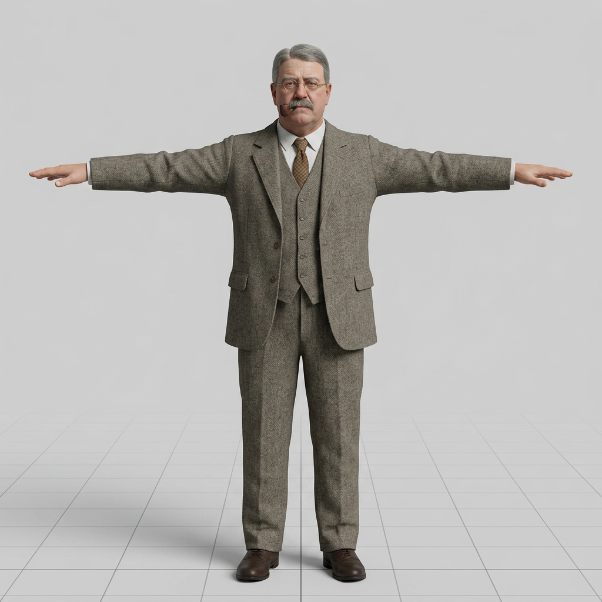
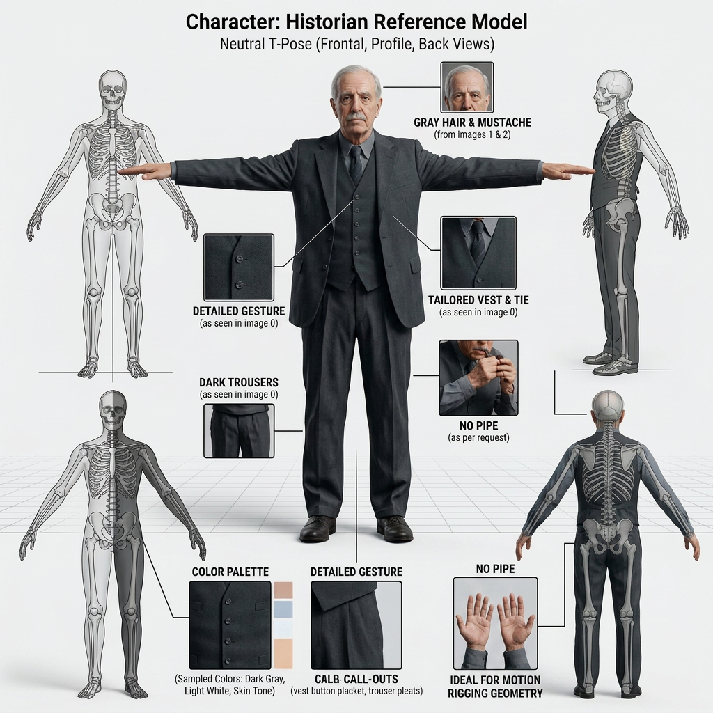
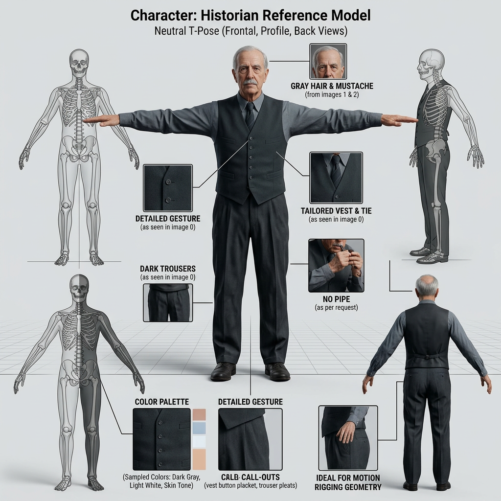
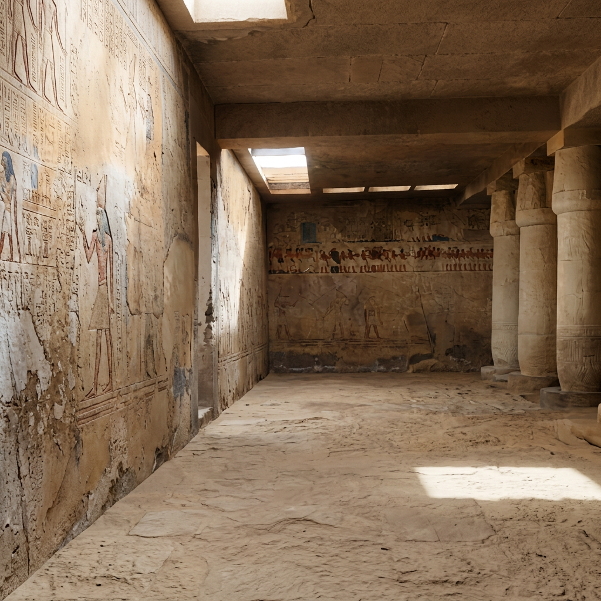
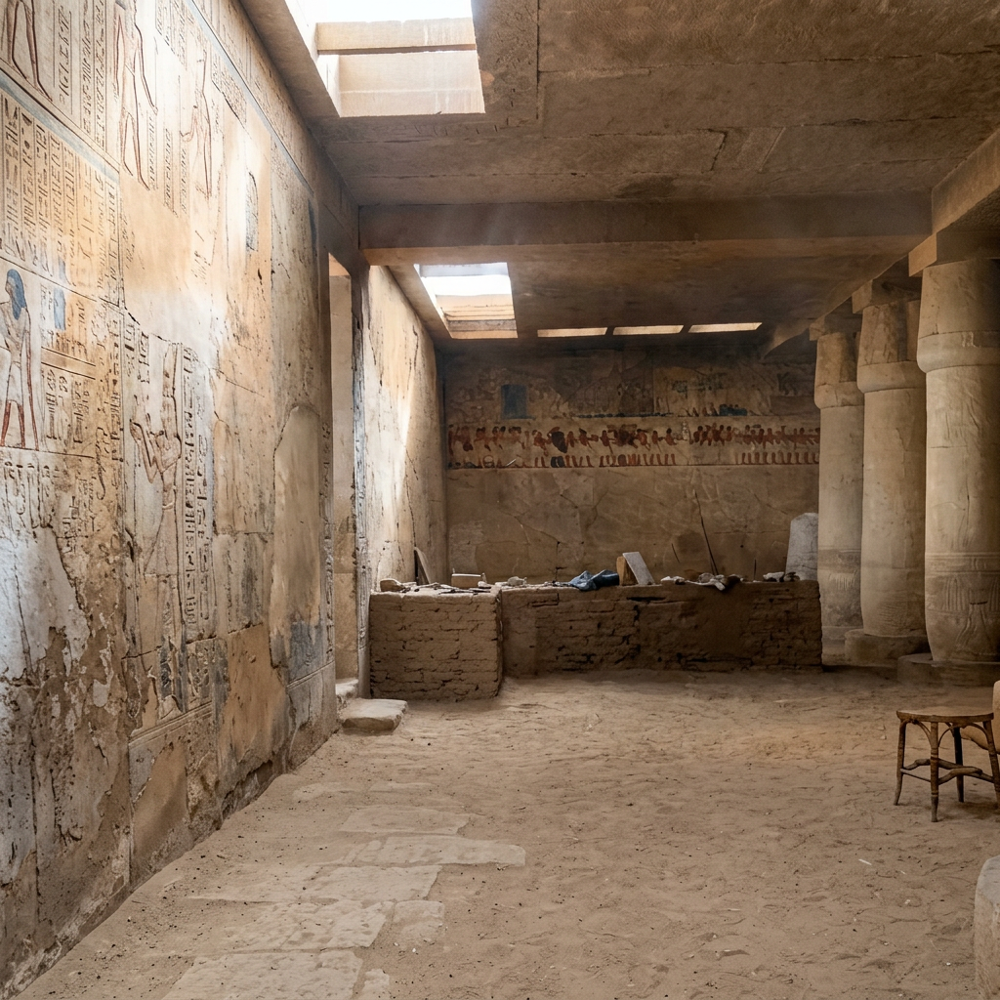
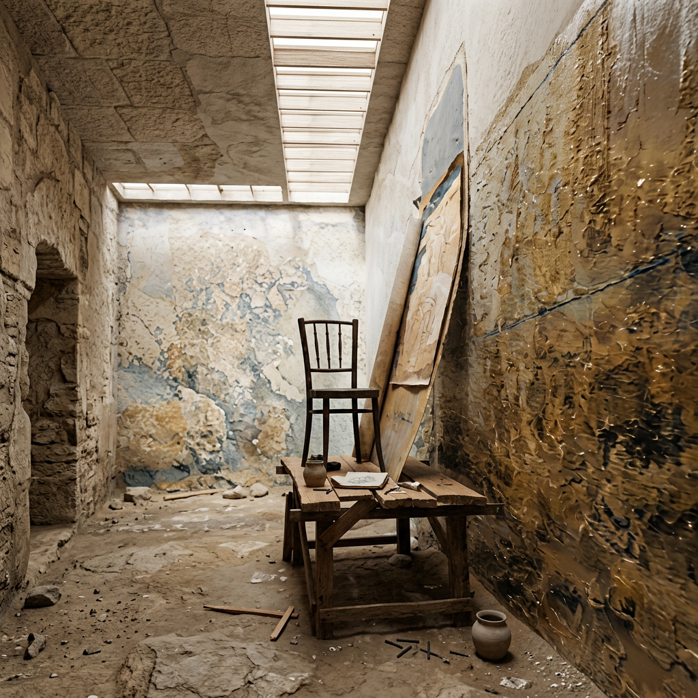
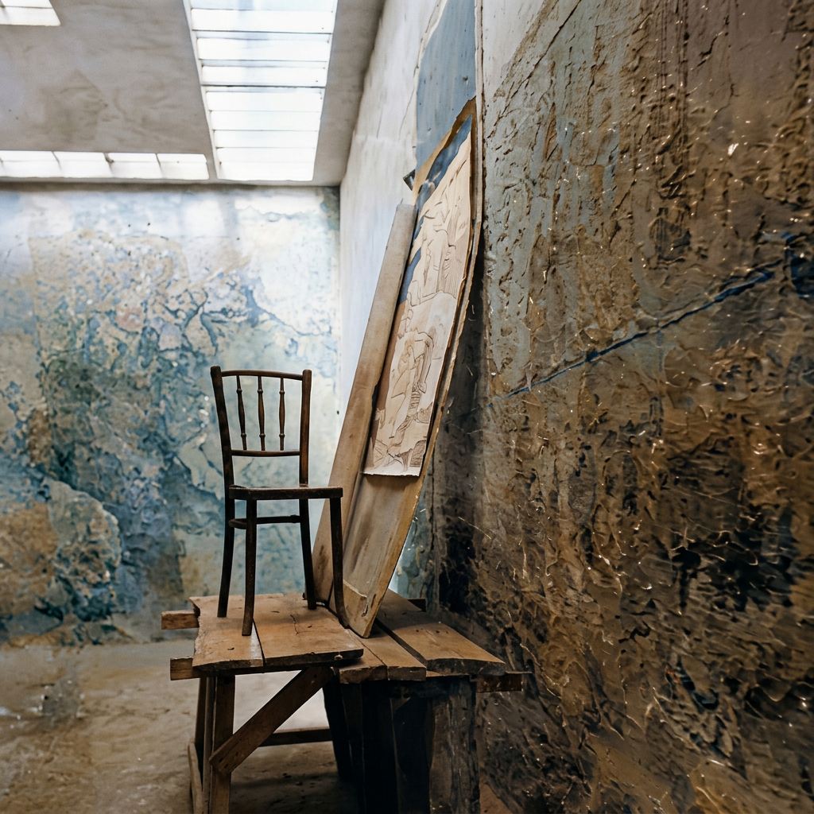

# Giza World

AI-powered Ancient Egyptian archaeological research platform. Browse 3D tomb reconstructions, chat with an AI knowledge agent trained on the G7050—G7070 excavation archives, and generate 3D character animations from text descriptions.

## Features

### 🏺 Type it! — Ancient Egyptian Knowledge Agent
- Claude-powered conversational AI with access to the complete G7050—G7070 tomb archives
- 171 indexed archival photos, maps, plans, manuscripts, and expedition diaries
- Natural language queries: "Show me the sarcophagus photos" / "What architrave records exist?"
- Inline photo display with lightbox viewer
- Source-based citation with academic rigor

### 🤖 AI Studio — Text to Motion
- Generate 3D character animations from natural language descriptions
- Target characters: Hathor, Menkaure, Ranefer
- Adjustable duration and intensity parameters
- Powered by Tripo API

### 🏛️ Scene Viewer
- Real-time 3D Gaussian Splatting rendering via Spark.js (World Labs)
- Two Giza archaeological scenes with PLY/SPZ support
- Orbit controls, scene switching, and character animation playback

### 🔬 3D World Generation (New!)
- See3D (BAAI, CVPR 2025 Highlight) deployed on 4× NVIDIA RTX 4090
- Single image → explorable 3D Gaussian Splatting scene
- End-to-end pipeline: upload photo → AI generates 3DGS → browser rendering

### 🏛️ AI Scene & Character Reconstructions
AI-generated reconstructions of Giza excavation figures and tomb scenes, rendered from the project archive.

#### 👤 Character Models
T-pose character models of the historical Egyptology experts who excavated the Giza pyramids.

| Joseph 1 | Joseph 2 | Reisner 1 | Reisner 2 |
|---|---|---|---|
| [](docs/scene-remake/joseph-t/joseph-t-03.png) | [](docs/scene-remake/joseph-t/joseph-t-05.png) | [](docs/scene-remake/reisner/reisner-01.png) | [](docs/scene-remake/reisner/reisner-02.png) |

Character reference sheets:

| Joseph reference | Joseph reference 2 |
|---|---|
| [](docs/scene-remake/joseph-t/joseph-t-01.png) | [](docs/scene-remake/joseph-t/joseph-t-06.png) |

#### 🏺 Tomb Scene Reconstructions

**Scene S1 — Tomb Interior** — multi-view reconstruction of the tomb interior.

| View 1 | View 2 |
|---|---|
| [](docs/scene-remake/s1/s1-01.png) | [](docs/scene-remake/s1/s1-02.png) |

**Scene S3 — Work Chamber** — multi-view reconstruction of the chamber with furniture.

| View 1 | View 2 |
|---|---|
| [](docs/scene-remake/s3/s3-01.png) | [](docs/scene-remake/s3/s3-02.png) |

## Tech Stack

| Layer | Technology |
|-------|-----------|
| 3D Rendering | Three.js, Spark (3DGS), Visionary (WebGPU) |
| AI Chat | Anthropic Claude API (Sonnet 4) |
| Text-to-Motion | Tripo API |
| 3D Scene Generation | See3D (BAAI, CVPR 2025 Highlight) |
| UI | Tailwind CSS, vanilla JavaScript |
| Server | Python HTTP server with API proxy |

## Quick Start

```bash
# Start the server
python server.py 8080

# Open in browser
# Home:      http://localhost:8080/v3.html
# Type it!:  http://localhost:8080/type-it.html
```

Requires Python 3.8+. For Type it!, an Anthropic API key is needed (configured in-app).

## Live Demo

**Home page & Scene Viewer:** https://asnow365.github.io/giza-world/v3.html

> **Note:** The Type it! AI Agent and See3D features require the Python server for API proxying. To use the full platform, clone the repo and run locally:
> ```bash
> python server.py 8080
> # Then open http://localhost:8080/v3.html
> ```

## GPU Deployment (See3D)

For 3D scene generation, deploy to a server with NVIDIA GPU (≥12GB VRAM):

```bash
unzip giza-project.zip
cd giza-project
bash deploy_gpu.sh          # Install deps + download See3D model (~10GB)
source venv/bin/activate
python see3d_api.py --port 8090  # Start GPU inference API
```

## Project Structure

```
├── v3.html                  # Home page
├── type-it.html             # AI Knowledge Agent
├── server.py                # Main server + API proxy
├── see3d_api.py             # See3D GPU inference API
├── deploy_gpu.sh            # GPU server deployment script
├── lib/                     # Three.js, gl-matrix
├── visionary-core.*.js      # Visionary 3DGS engine
├── data/                    # Archaeological data (JSON)
├── scene/                   # 3D scene files (PLY/SPZ)
└── motion/                  # Character models (GLB)
```

## Character Model Sources

King Menkaure, the goddess Hathor, and the deified Hare nome
Original object: Egyptian Old Kingdom, Dynasty 4, reign of Menkaure, ca. 2490–2472 BCE
Findspot: Menkaure Valley Temple, Giza, Egypt
Collection: Museum of Fine Arts, Boston, 09.200
3D source: Peter Der Manuelian / Sketchfab
Note: Photography by Zhejiang University; photogrammetry by David Anderson.
Usage: Non-commercial, educational purposes only.

Statue of Ranefer
Original object: Egyptian Old Kingdom, Dynasty 5, ca. 2475 BCE
Findspot: Saqqara, mastaba 40
Collection: Egyptian Museum, Cairo, JE 10063; CG 19
3D source: Peter Der Manuelian / Sketchfab
Note: Created with Polycam and iPhone 15 by Peter Der Manuelian, February 23, 2024.
Usage: Non-commercial, study purposes only.

## Data Sources

This demo is conceptually inspired by the Digital Giza Project, which also provides important data and reference materials for this project.
Digital Giza: https://giza.fas.harvard.edu/

## License

MIT — Giza World is open source. See3D and Visionary are used under their respective open-source licenses.
